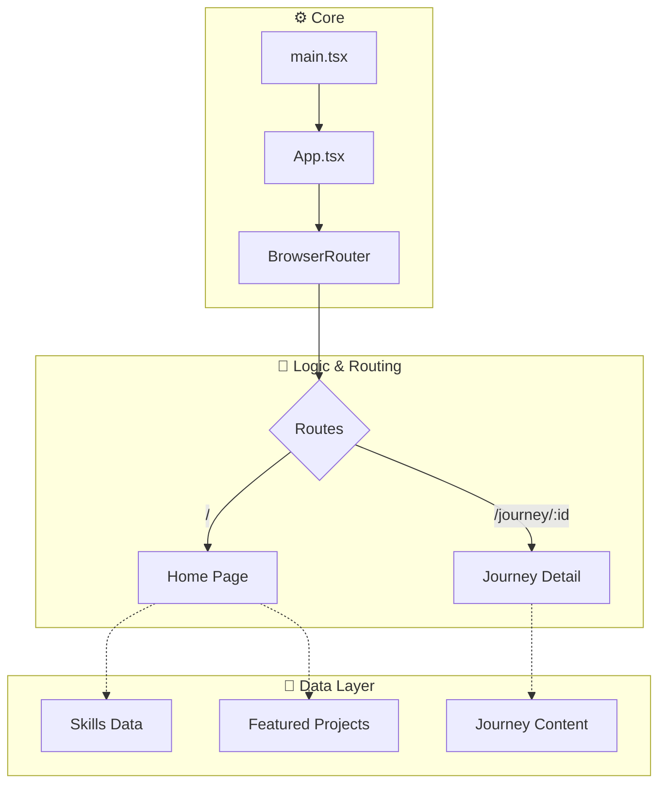
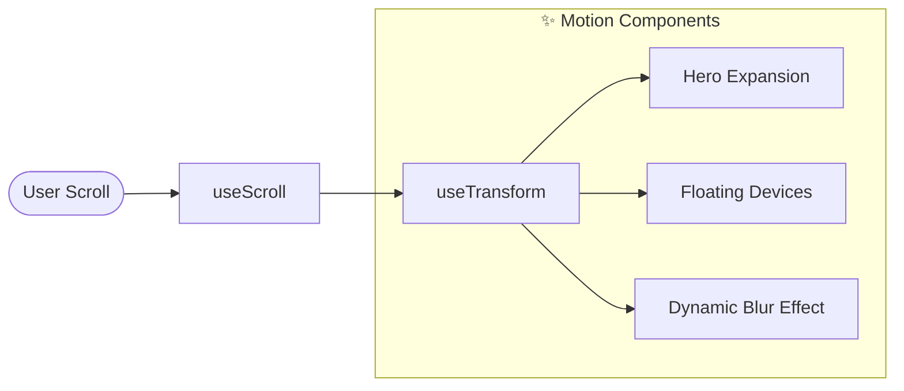
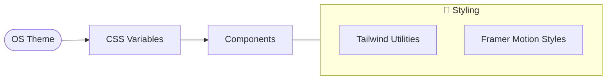

# 🚀 Dokyungja Home

> **AI-Native Developer Portfolio** - 중력을 거스르는 개발자의 포트폴리오 웹사이트

<p align="center">
  
</p>

---

## 📌 프로젝트 개요

이 프로젝트는 **도경자(Dokyungja)**의 개인 포트폴리오 웹사이트입니다. AI와 함께 개발하는 "Anti-Gravity" 철학을 담아, 현대적인 웹 기술과 세련된 애니메이션으로 제작되었습니다.

### 주요 특징

- 🎨 **Apple-style 애니메이션** - 부드러운 스크롤 기반 인터랙션
- 📱 **반응형 디자인** - 모든 디바이스에서 최적화된 UX
- 🌙 **다크/라이트 모드** - 시스템 설정에 따른 심리스한 전환
- ⚡ **고성능** - Vite + React 기반의 쾌적한 브라우징 경험

---

## 🛠️ 기술 스택

| 분류 | 기술 |
|------|------|
| **Frontend** | React 18, TypeScript, TailwindCSS |
| **Animation** | Framer Motion (motion/react) |
| **Build/Tool** | Vite, Lucide React, PostCSS |
| **Deployment** | GitHub Actions & Pages |

---

## � 코드 흐름 및 구조 (Architecture)

### 1. 전체 서비스 구조



### 2. 스크롤 인터랙션 흐름 (Scroll & Motion)



### 3. 상태 및 테마 흐름



---

## 📁 프로젝트 구조

```
src/
├── assets/           # 캐릭터 및 디바이스 이미지 자원
├── components/
│   ├── common/       # FloatingDevice, ThemeToggle 등 공용 컴포넌트
│   ├── landing/      # Hero, JourneyMap, Skills 등 각 섹션
│   └── layout/       # Header, Footer, Layout Wrapper
├── pages/            # Home, JourneyDetail 페이지 유닛
├── styles/           # Tailwind 및 전역 테마 변수
└── lib/              # 공통 유틸리티
```

---

## 🎬 주요 섹션 가이드

### 1. Hero Expansion

- 스크롤 진행률(`scrollYProgress`)에 따라 중앙 이미지가 화면 전체로 확장됩니다.
- 입체감을 위한 마우스 트래킹 그라데이션이 적용되어 있습니다.

### 2. Floating Devices (with Dynamic Blur)

- 스크롤 시 좌우에서 디바이스 이미지가 화면 중앙으로 슬라이드됩니다.
- 등장이 시작될 때 `blur(8px)`에서 점차 `blur(0)`로 선명해지며 몰입감을 줍니다.

### 3. Skills Universe (Lego-style)

- 카테고리별(Dev, Infra, Business) 논리적 그룹화.
- 레고 블록처럼 다양한 크기의 Grid 레이아웃과 호버 시 3D 리프트 효과.

### 4. Journey Map & Navigation

- 고유 ID(`journey-tech` 등)를 이용한 앵커 시스템.
- 상세 페이지 탐색 후 복귀 시 사용자가 보던 위치로 자동 스크롤 복원.

---

## 📄 라이선스

이 프로젝트는 개인 포트폴리오용으로 제작되었습니다.

---

## 👨‍💻 개발자

**도경자 (Dokyungja)**

- 💻 [dev.dokyungja.us](https://dev.dokyungja.us)

---

> *"Gravity is just a suggestion."* - Anti-Gravity Philosophy
