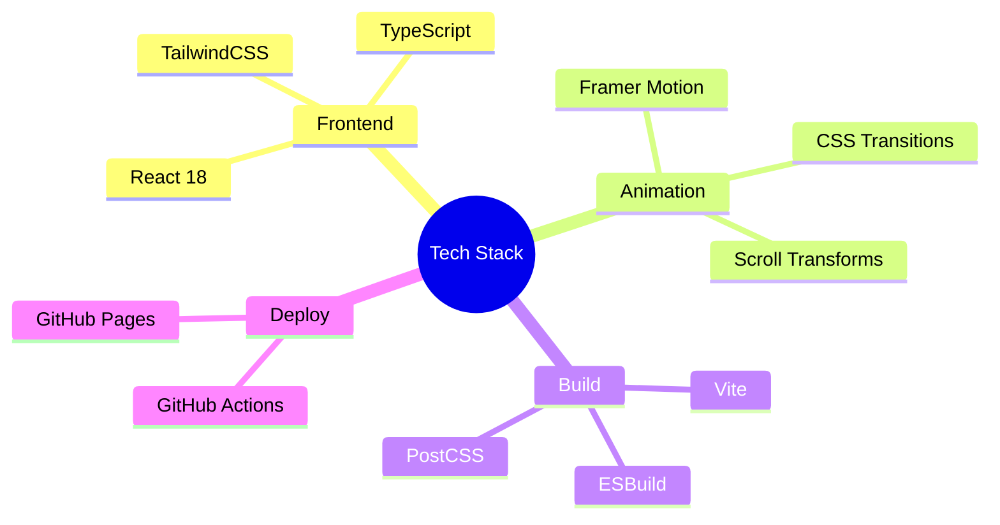
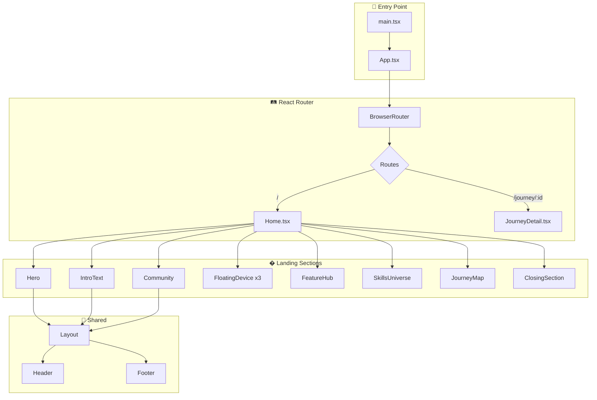
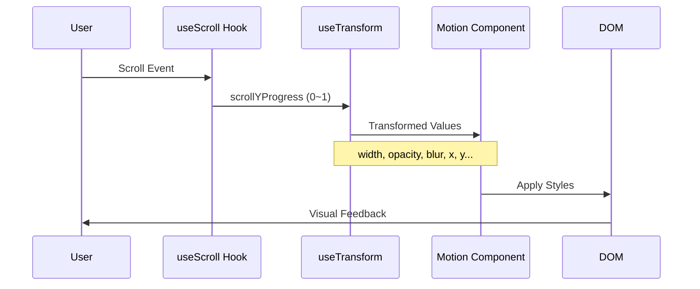
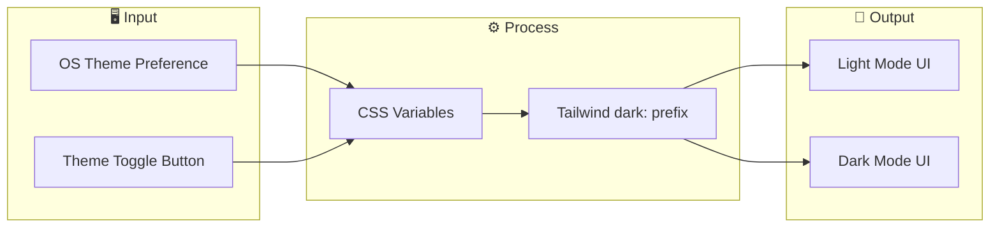

# 🚀 Dokyungja Home

> **AI-Native Developer Portfolio** - 중력을 거스르는 개발자의 포트폴리오 웹사이트

<p align="center">
  
</p>

<p align="center">
  <a href="https://every-git.github.io/dokyungja-home/">
    
  </a>
  
  
  
</p>

---

## 🌟 Anti-Gravity Philosophy

> *"Gravity is just a suggestion."*

기존의 개발 관습과 한계라는 **'중력'**을 거부합니다. AI 에이전트 기반의 워크플로우를 통해 생산성의 물리적 한계를 뛰어넘고, 새로운 기술의 우주를 유영합니다.

이 포트폴리오는 AI와 함께 탐구하고 실험하는 과정의 기록입니다.

---

## 📌 프로젝트 개요

이 프로젝트는 **도경자(Dokyungja)** 의 개인 포트폴리오 웹사이트입니다. AI와 함께 개발하는 "Anti-Gravity" 철학을 담아, 현대적인 웹 기술과 세련된 애니메이션으로 제작되었습니다.

### ✨ 주요 특징

| 특징 | 설명 |
|------|------|
| 🎨 **Apple-style 애니메이션** | 스크롤 기반의 시네마틱 인터랙션, 마우스 트래킹 그라데이션 |
| 📱 **반응형 디자인** | 모바일, 태블릿, 데스크탑 모든 환경에서 최적화 |
| 🌙 **다크/라이트 모드** | 시스템 설정에 따른 심리스한 자동 전환 |
| ⚡ **고성능** | Vite + React 기반, 0.1초대 빌드, Cloudflare Edge 배포 |
| 🧩 **모듈화 아키텍처** | 섹션별 컴포넌트 분리로 유지보수 용이 |

---

## 🛠️ 기술 스택



---

## 📚 코드 흐름 및 구조 (Architecture)

### 1. 전체 서비스 구조



### 2. 스크롤 애니메이션 파이프라인



### 3. 테마 시스템



---

## 📁 프로젝트 구조

```
dokyungja-home/
├── public/
│   └── 404.html              # SPA 라우팅 지원
├── src/
│   ├── assets/images/        # 캐릭터, 디바이스 이미지
│   ├── components/
│   │   ├── common/           # FloatingDevice, ThemeToggle
│   │   ├── landing/          # 각 섹션 컴포넌트 (10개)
│   │   └── layout/           # Header, Footer, Layout
│   ├── pages/                # Home, JourneyDetail
│   ├── styles/               # Tailwind, Theme CSS
│   ├── lib/                  # 유틸리티 함수
│   ├── App.tsx               # 라우팅 설정
│   └── main.tsx              # 엔트리 포인트
├── .github/workflows/        # CI/CD (GitHub Actions)
└── vite.config.ts            # Vite 설정 (base path 등)
```

---

## 🎬 주요 섹션 상세

### 1. 🦸 Hero Expansion

스크롤 진행률에 따라 중앙 이미지가 **30% → 100%**로 확장됩니다.  
마우스 위치에 반응하는 동적 그라데이션으로 입체감을 더합니다.

### 2. ✍️ IntroText (Toss-style)

"AI-Native Developer" 텍스트가 **글자 단위로 순차 등장**합니다.  
blur → clear 효과로 몰입감 있는 텍스트 애니메이션을 구현했습니다.

### 3. 📱 Floating Devices

스크롤 시 좌/우에서 디바이스가 **블러 상태로 등장 → 선명해지며 중앙으로 이동**합니다.  
뉴스벨, AI 로봇 등 커스텀 이미지와 둥둥 떠다니는 플로팅 효과가 적용됩니다.

### 4. 🧱 Skills Universe (Lego-style)

카테고리별(Development, Infrastructure, Business) **레고 블록 스타일** 레이아웃.  
각 블록은 호버 시 **3D 리프트 효과**와 함께 떠오릅니다.

### 5. 🗺️ Journey Map

4개의 스토리 섹션 (Tech, Economy, Shop, Art).  
**앵커 기반 스크롤 복원** — 상세 페이지에서 돌아와도 원래 위치로 정확히 이동합니다.

### 6. 👋 Closing Section

"Gravity is just a suggestion" 메시지와 함께 **펄스 애니메이션**으로 기대감을 유지합니다.

---

## 🔗 라이브 데모

👉 **[https://every-git.github.io/dokyungja-home/](https://every-git.github.io/dokyungja-home/)**

---

## 📄 라이선스

이 프로젝트는 개인 포트폴리오용으로 제작되었습니다.

---

## 👨‍💻 개발자

**도경자 (Dokyungja)**

- 💻 [dev.dokyungja.us](https://dev.dokyungja.us)

---

<p align="center">
  <b><i>"Gravity is just a suggestion."</i></b> — Anti-Gravity Philosophy
</p>
