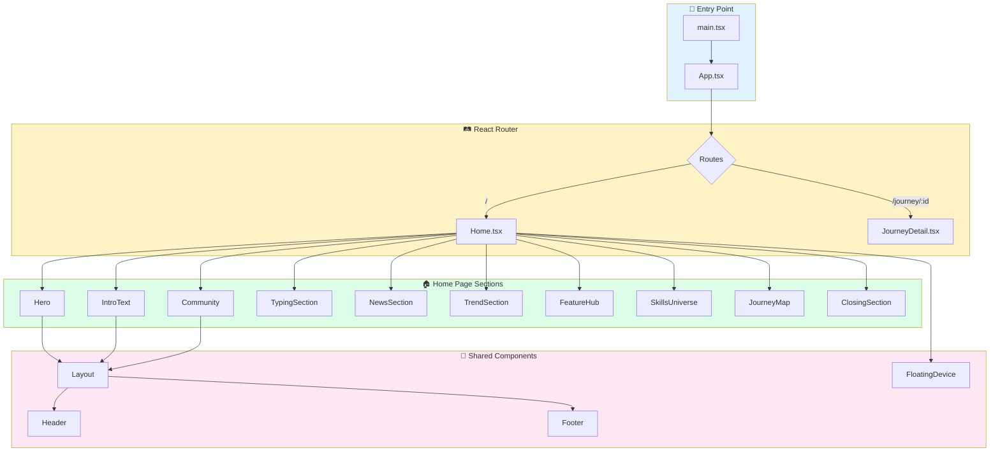

# 🚀 Dokyungja Home

> **AI-Native Developer Portfolio** - 중력을 거스르는 개발자의 포트폴리오 웹사이트

<p align="center">
  
</p>

## 📌 프로젝트 개요

이 프로젝트는 **도경자(Dokyungja)**의 개인 포트폴리오 웹사이트입니다. AI와 함께 개발하는 "Anti-Gravity" 철학을 담아, 현대적인 웹 기술과 세련된 애니메이션으로 제작되었습니다.

### 주요 특징

- 🎨 **Apple-style 애니메이션** - 부드러운 스크롤 기반 인터랙션
- 📱 **반응형 디자인** - 모바일, 태블릿, 데스크탑 완벽 지원
- 🌙 **다크/라이트 모드** - 시스템 설정에 따른 자동 전환
- ⚡ **고성능** - Vite 기반 빠른 빌드와 최적화

---

## 🛠️ 기술 스택

| 분류 | 기술 |
|------|------|
| **Framework** | React 18 + TypeScript |
| **Build Tool** | Vite |
| **Styling** | TailwindCSS + CSS Variables |
| **Animation** | Framer Motion (motion/react) |
| **Routing** | React Router DOM |
| **Icons** | Lucide React |
| **Deployment** | GitHub Pages / Cloudflare Pages |

---

## 📁 프로젝트 구조

```
dokyungja-home/
├── src/
│   ├── assets/           # 이미지, 폰트 등 정적 자원
│   │   └── images/       # 캐릭터, 디바이스, 배경 이미지
│   ├── components/       # 재사용 가능한 컴포넌트
│   │   ├── common/       # 공통 컴포넌트 (FloatingDevice, etc.)
│   │   ├── landing/      # 랜딩 페이지 섹션 컴포넌트
│   │   └── layout/       # 레이아웃 컴포넌트 (Header, Footer)
│   ├── hooks/            # 커스텀 React 훅
│   ├── lib/              # 유틸리티 함수
│   ├── pages/            # 페이지 컴포넌트
│   ├── styles/           # 전역 스타일 및 테마
│   ├── App.tsx           # 메인 앱 컴포넌트 + 라우팅
│   └── main.tsx          # 엔트리 포인트
├── index.html            # HTML 템플릿
├── vite.config.ts        # Vite 설정
├── tailwind.config.js    # TailwindCSS 설정
└── package.json          # 의존성 및 스크립트
```

---

## 🔄 코드 흐름 (Architecture)



---

## 🎬 주요 섹션 설명

### 1. Hero Section

- 스크롤 기반 **확장 이미지 애니메이션**
- 마우스 인터랙션에 반응하는 그라데이션 배경

### 2. IntroText Section

- **Toss-style** 글자별 애니메이션
- "AI-Native Developer" 타이핑 효과

### 3. FloatingDevice

- 스크롤에 따라 **좌우에서 슬라이드** 되는 디바이스/이미지
- 블러 → 선명 전환 효과
- 둥둥 떠다니는 플로팅 애니메이션

### 4. SkillsUniverse (Built for Impact)

- **레고 블록 스타일** 레이아웃
- 카테고리별 논리적 구조 (Development, Infrastructure, Design & Business)

### 5. JourneyMap

- 4개의 스토리 섹션 (Tech, Economy, Shop, Art)
- **앵커 기반 네비게이션** - 상세 페이지 왔다갔다 시 스크롤 위치 복원

---

## 🚀 시작하기

### 설치

```bash
# 저장소 클론
git clone https://github.com/YOUR_USERNAME/dokyungja-home.git
cd dokyungja-home

# 의존성 설치
npm install
```

### 개발 서버 실행

```bash
npm run dev
```

브라우저에서 `http://localhost:5173` 접속

### 프로덕션 빌드

```bash
npm run build
```

빌드 결과물은 `dist/` 폴더에 생성됩니다.

### 미리보기

```bash
npm run preview
```

---

## 📦 배포

### GitHub Pages

```bash
# gh-pages 브랜치로 배포
npm run build
# dist 폴더를 gh-pages 브랜치로 푸시
```

### Cloudflare Pages

1. Cloudflare Dashboard에서 Pages 프로젝트 생성
2. GitHub 저장소 연결
3. Build command: `npm run build`
4. Build output directory: `dist`

---

## 🎨 커스터마이징

### 색상 테마 변경

`src/styles/theme.css`에서 CSS 변수를 수정하세요:

```css
:root {
  --primary: /* 메인 색상 */;
  --background: /* 배경 색상 */;
  --foreground: /* 텍스트 색상 */;
}
```

### 새 섹션 추가

1. `src/components/landing/`에 새 컴포넌트 생성
2. `src/pages/Home.tsx`에서 import 및 추가

---

## 📄 라이선스

이 프로젝트는 개인 포트폴리오용으로 제작되었습니다.

---

## 👨‍💻 개발자

**도경자 (Dokyungja)**

- 💻 [dev.dokyungja.us](https://dev.dokyungja.us)

---

> *"Gravity is just a suggestion."* - Anti-Gravity Philosophy
